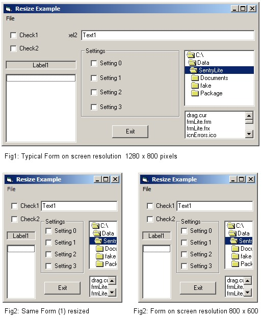



## Quick, effective Forms resizing code\.

### Description

Quick, effective Forms resizing without a 'resize component'.
 
### More Info
 
Most 'resize controls/solutions' scale controls and font sizes proportionally.

This is never what I actually want. Usually, GUI's have textboxes and list

controls that can be simply stretched or shrunk as appropriate.

Also, 'Tool' windows are nice when small, but it is really useful to allow users

to stretch the window and see all text in the textbox (eg, nested foldernames).

'

Just using an arbitrary fraction of the 'screen width' for a 'margin' constant

works well for resizing but falls apart if the screen resolution or aspect ratio

change, this approach avoids that problem.

'

It simply uses the Form's TextWidth and TextHeight properties, fractions of which

are assigned to two variables (used as the base unit for all static dimensions).

'

A dummy project is included, as an example of how to Utilize these two derived

constants. Switching resolution, aspect ratio or resizing should leave your form

looking pretty much the same.

'

Note: The method 'as is' does assume that the project is using the 'default' VB

scalemodes and font sizes (which are perfectly suitable for most applications.)

'

             |
---                |---
**Submitted On**   |2006-12-08 13:11:18
**By**             |[Ken Ashton](https://github.com/Planet-Source-Code/PSCIndex/blob/master/ByAuthor/ken-ashton.md)
**Level**          |Beginner
**User Rating**    |4.8 (29 globes from 6 users)
**Compatibility**  |VB 6\.0
**Category**       |[Custom Controls/ Forms/  Menus](https://github.com/Planet-Source-Code/PSCIndex/blob/master/ByCategory/custom-controls-forms-menus__1-4.md)
**World**          |[Visual Basic](https://github.com/Planet-Source-Code/PSCIndex/blob/master/ByWorld/visual-basic.md)
**Archive File**   |[Quick\_\_eff2036391282006\.zip](https://github.com/Planet-Source-Code/ken-ashton-quick-effective-forms-resizing-code__1-67322/archive/master.zip)

